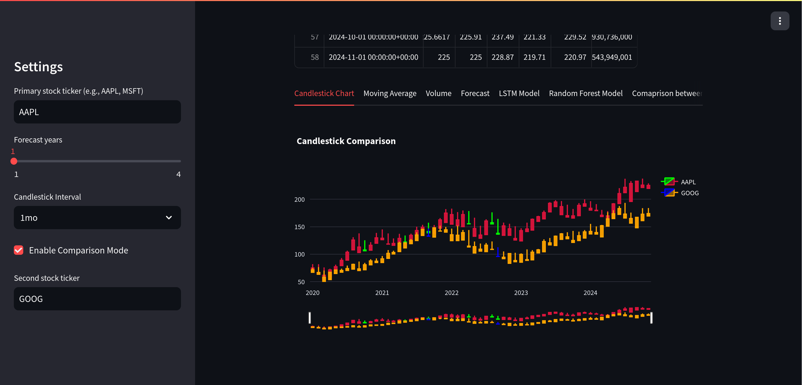
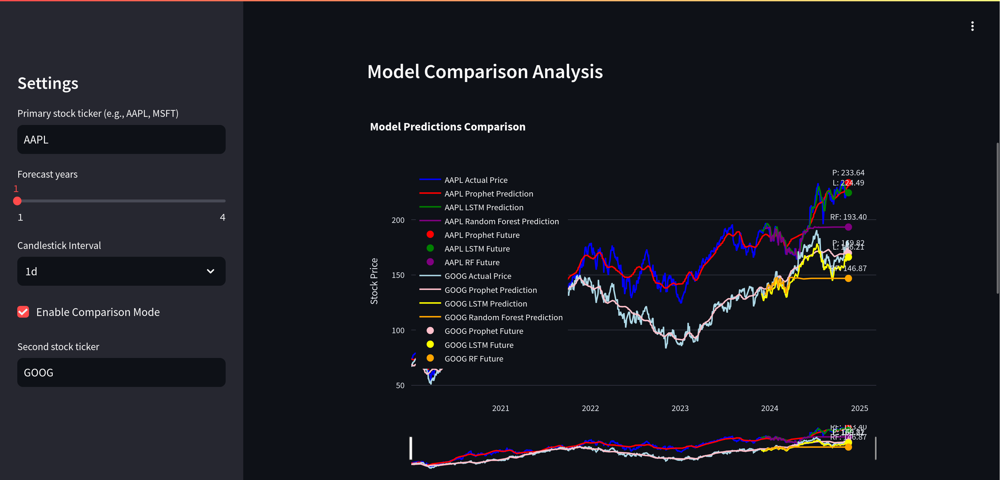
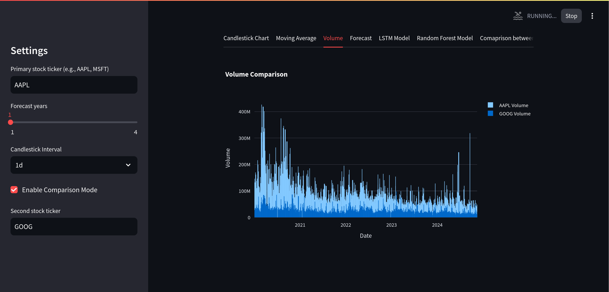

# 📈 Stock Price Prediction and Analysis Tool

Welcome to our Stock Price Prediction and Analysis Tool! This Python-based project leverages state-of-the-art machine learning algorithms to forecast stock prices and visualize stock data with interactive charts.

---

## 🌟 Features

### **1. Stock Price Prediction Models**
- **LSTM (Long Short-Term Memory):** Ideal for sequential data and time series predictions.
- **Random Forest:** A robust ensemble learning method for regression tasks.
- **Prophet by Meta:** A powerful forecasting tool for time series data.

### **2. Comparative Analysis**
- Compare the predictions of different models side-by-side.
- Gain insights into which model performs best for specific stocks or timeframes.

### **3. Interactive Charts and Visualizations**
- **Candlestick Charts:** Explore daily price movements with high, low, open, and close prices.
- **Moving Averages:** Visualize short-term and long-term trends.
- **Volume Analysis:** Understand trading volume patterns.
- **Model Prediction Comparisons:** Graphs comparing predictions from different models.

---

## 📊 Sample Visuals

| Feature                  | Screenshot                                   |
|--------------------------|---------------------------------------------|
| **Candlestick Chart**    |  |
| **Model Comparisons**    |  |
| **Volume and Trends**    |  |

---

## License
 
<a property="dct:title" rel="cc:attributionURL" href="https://github.com/Shanu-Kumawat/TradePulse">TradePulse</a> by <a rel="cc:attributionURL dct:creator" property="cc:attributionName" href="https://github.com/Shanu-Kumawat">Team Navneet Sena</a> is licensed under <a href="https://creativecommons.org/licenses/by-nc-nd/4.0/?ref=chooser-v1" target="_blank" rel="license noopener noreferrer" style="display:inline-block;">CC BY-NC-ND 4.0</a>
 